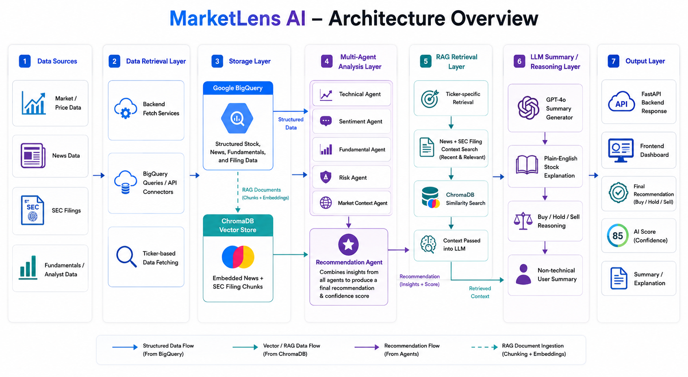

### MarketLens AI – Architecture Overview



---

## Project Architecture Overview

MarketLens AI is an AI-powered stock research platform designed to help users analyze stocks using a combination of:

- Multi-Agent Stock Analysis
- GPT-Powered Sentiment Analysis
- Technical + Fundamental + Risk Scoring
- RAG-based Retrieval from Recent News and SEC Filings
- ChromaDB Vector Database
- Google BigQuery
- FastAPI Backend
- Frontend Stock Dashboard
- Plain-English AI Summaries for Non-Technical Users

The application enables users to enter a stock ticker such as **AAPL**, **MSFT**, **NVDA**, or **AMZN** and receive a complete AI-generated stock analysis with:

- Technical stock trend signals
- News sentiment reasoning
- Company fundamentals analysis
- Risk scoring
- Market context
- Buy / Hold / Sell recommendation
- Beginner-friendly AI explanation
- Retrieved stock-specific context from recent news and SEC filings

---

## Architecture Layers

```text
User opens dashboard
    ↓
Stock ticker input
    ↓
Frontend dashboard request
    ↓
FastAPI backend
    ↓
BigQuery stock/news/filings fetch
    ↓
Multi-Agent Analysis Layer
    ↓
Recommendation Layer
    ↓
RAG Retrieval Layer
    ↓
GPT Summary Layer
    ↓
Frontend stock analysis output
```
## 1. User Access Layer
Users interact with MarketLens AI through the frontend stock dashboard.

The user workflow is simple:

# User Capabilities
Enter a stock ticker such as AAPL

- Trigger AI stock analysis
- View stock recommendation
- Read technical, sentiment, fundamentals, and risk outputs
- Read plain-English AI stock explanation
- Review stock reasoning in one place
- The goal of this layer is to make stock research simple even for users who are not finance experts.

## 2. Frontend Layer
The frontend acts as the user-facing stock research dashboard.

Frontend responsibilities include:

- Frontend Features
- Stock ticker input/search
- Analyze button
- AI score display
- Buy / Hold / Sell recommendation card
- Technical analysis section
- Sentiment analysis section
- Fundamentals section
- Risk section
- Market context section
- Plain-English AI summary section

# Frontend Flow
```text
User enters ticker
    ↓
Clicks Analyze
    ↓
Frontend sends request to backend
    ↓
Receives AI stock analysis response
    ↓
Displays recommendation + reasoning
```
## 3. Backend API Layer

# The backend is implemented using FastAPI.
# It is responsible for:

- receiving ticker-based analysis requests
- fetching stock-related data
- calling the stock analysis agents
- retrieving relevant RAG context
- generating final GPT summaries
- returning structured stock analysis responses

## Main backend endpoints

# Stock Analysis Endpoint

```text
GET /ai/analyze/{ticker}
```
Example:
```text
GET /ai/analyze/AAPL
```
This endpoint returns:

- technical analysis
- sentiment analysis
- fundamentals analysis
- risk analysis
- market context
- final recommendation
- AI score
- reasons
- RAG context
- LLM-generated stock summary

# RAG Retrieval Endpoint
```text
GET /rag/search/{ticker}
```
Example:
```text
GET /rag/search/AAPL
```
This endpoint returns ticker-specific retrieved documents from the vector database.

## 4. Data Collection Layer
Before analysis begins, the backend fetches structured stock data.

MarketLens AI uses stock-related datasets such as:

- technical indicators
- company fundamentals
- recent stock news
- SEC filings
- macro / analyst context

These datasets are fetched from:

```text
Google BigQuery
```
The purpose of this layer is to centralize all stock-related information required by the AI agents.

## 5. BigQuery Data Layer
MarketLens AI uses Google BigQuery as the primary data source for stock analysis.

Data stored in BigQuery includes:

# Stock Data

- ticker-specific market indicators
- price-related signals
- company fundamentals
- recent stock news
- SEC filing metadata / content
- market context inputs
-
# BigQuery Flow

```text
Ticker request
    ↓
Backend query functions
    ↓
BigQuery datasets
    ↓
Indicators + fundamentals + news + SEC filings
```
## 6. Multi-Agent Analysis Layer
The core of MarketLens AI is a multi-agent stock analysis pipeline.

Instead of relying on one generic AI prompt, the platform uses multiple specialized agents, where each agent focuses on one part of stock analysis.

## Agents Used in MarketLens AI

# Technical Agent

Purpose:

- analyze stock trend and technical indicators
- identify bullish / bearish signals
- generate technical score and reasons

Example output:
```text
{
  "signal": "Bullish",
  "score": 70,
  "reasons": ["Price trend is bullish"]
}
```
# Sentiment Agent
Purpose:

- analyze recent stock-related news using GPT
- identify positive / negative sentiment drivers
- explain how recent news affects the stock

Example:

- supply chain issues
- price hike concerns
- regulatory news
- earnings-related headlines
- macroeconomic impact
- Fundamental Agent
Purpose:
- evaluate company valuation and financial quality
- look at metrics such as P/E ratio, company size, and business strength
- produce a fundamentals score and reasons

# Risk Agent
Purpose:

- measure stock volatility and risk level
- identify whether the stock looks relatively stable or risky
- return risk signal and risk score

# Market Context Agent
Purpose:

- consider broader market / macro context
- include economic signals or analyst-related context where available
- return a market context signal

# Recommendation Agent
Purpose:

- combine outputs from all other agents
- generate a final stock recommendation
return:
- Buy / Hold / Sell
- final AI score
- consolidated reasoning

# LLM Agent
Purpose:

- take all structured agent outputs
- combine them with retrieved RAG context
- generate a plain-English stock summary for non-technical users

# Multi-Agent Flow

```text
BigQuery stock data
    ↓
Technical Agent
Sentiment Agent
Fundamental Agent
Risk Agent
Market Context Agent
    ↓
Recommendation Agent
    ↓
Final stock score + recommendation
```

## 7. Recommendation Layer
Once all agent outputs are available, the Recommendation Agent combines them into a final stock decision.

The recommendation layer produces:

- final recommendation: Buy / Hold / Sell
- AI score
- consolidated reasons from multiple agents

This layer acts as the bridge between raw agent analysis and the final stock decision shown to the user.

# Recommendation Flow
```text
Technical score
Sentiment score
Fundamental score
Risk score
Market context score
        ↓
Recommendation Agent
        ↓
Final Recommendation + AI Score
```
## 8. RAG / Vector Database Layer
MarketLens AI uses Retrieval-Augmented Generation (RAG) to improve the quality of the final AI stock explanation.

Instead of relying only on agent scores, the platform retrieves ticker-specific recent company context from a vector database.

What gets stored in the vector database?
For each stock, MarketLens AI stores:

- Recent stock news from the last 1 year
- Recent SEC filings from the last 1 year

These documents are embedded using OpenAI embeddings and stored in ChromaDB.

# Why RAG is used
RAG helps GPT generate better summaries by giving it recent stock-specific context such as:

- company-related news
- pricing or demand issues
- supply chain concerns
- recent SEC filing activity
- risk-related developments
- company announcements
- broader stock-specific context

Without RAG, the model only sees structured scores.
With RAG, it also sees relevant recent company context.

# RAG Flow
```text
Recent News + SEC Filings
        ↓
OpenAI Embeddings
        ↓
ChromaDB Vector Store
        ↓
Ticker-specific Retrieval
        ↓
Relevant context returned to backend
```
## 9. ChromaDB Vector Store Layer
The vector database used in MarketLens AI is:
```text
ChromaDB
```
ChromaDB stores vectorized ticker-specific documents for retrieval.

# Stored document categories
- News documents
- SEC filing documents

Each stored document includes metadata such as:
- ticker
- document source
- document type

This makes it possible to retrieve only documents relevant to a specific stock.

## 10. GPT Summary Layer
After the recommendation and RAG retrieval are complete, the LLM Agent generates the final stock explanation.

This layer uses:

- technical analysis output
- sentiment output
- fundamentals output
- risk output
- market context output
- final recommendation
- retrieved RAG context

and sends them to GPT-4o to generate a stock explanation in plain English.

# Why this layer matters
A raw JSON response is useful for engineers, but not ideal for normal users.

The GPT summary layer converts technical stock reasoning into a format like:

```text
Stock: AAPL

Recommendation:
Hold — Apple still looks stable, but rising chip costs and possible iPhone price hikes create short-term pressure.

What looks good:
- Positive stock trend
- Strong company size and stability
- Lower volatility compared to many tech stocks

What to watch out for:
- Supply chain cost pressure
- Possible demand impact from higher prices
- Valuation may already be expensive

Simple takeaway:
Apple remains a strong company overall, but near-term risks make it look more like a hold than an aggressive buy right now.
```
This makes the output understandable for **non-technical users and beginner investors.**

## 11. Plain-English Output Layer
One of the main design goals of MarketLens AI is to avoid finance-heavy output.

This layer ensures the final response is understandable by:

- beginner investors
- non-technical users
- hackathon judges
- recruiters reviewing the project
- anyone who wants a quick stock summary without reading raw metrics

The final stock summary focuses on:

- what looks good
- what looks risky
- why the recommendation is Buy / Hold / Sell
- what the user should take away

## 12. Error Handling Layer
The backend uses safe fallback handling to avoid breaking the user experience if one AI component fails.

Handled failure scenarios include:

- OpenAI response failure
- sentiment analysis failure
- missing news data
- missing SEC data
- BigQuery query issues
- RAG retrieval issues
- summary generation failure

Fallback behavior ensures the API still returns a safe response even if one layer fails.

Example fallback:

```text
{
  "signal": "Neutral",
  "score": 50,
  "reasons": ["No news data available"]
}
```
## 13. API Response Layer
The final response returned to the frontend is structured JSON containing all major stock analysis outputs.

Example response:
```text
{
  "ticker": "AAPL",
  "technical": {
    "signal": "Bullish",
    "score": 70,
    "reasons": ["Price trend is bullish"]
  },
  "sentiment": {
    "signal": "Negative",
    "score": 40,
    "reasons": [
      "Rising chip costs may pressure Apple margins",
      "Potential iPhone price hikes may affect demand"
    ]
  },
  "fundamentals": {
    "signal": "Neutral",
    "score": 55,
    "reasons": [
      "P/E ratio is relatively high",
      "Company has strong market capitalization"
    ]
  },
  "risk": {
    "signal": "Low Risk",
    "score": 65,
    "reasons": ["Volatility is low"]
  },
  "market_context": {
    "signal": "Neutral",
    "score": 50,
    "reasons": ["Macro/economic context considered"]
  },
  "final_recommendation": "Hold",
  "ai_score": 57,
  "reasons": [
    "Price trend is bullish",
    "Rising chip costs may pressure Apple margins",
    "Company has strong market capitalization"
  ],
  "llm_summary": "Apple still looks like a strong company overall, but recent supply-chain and pricing pressures make it more of a hold than an aggressive buy right now."
}
```
### Screenshots

# Main Dashboard

# Stock Analysis Result

# Multi-Agent Breakdown

# RAG Search / Vector Retrieval

# Backend API Analysis Endpoint

# Plain-English AI Summary

### Complete End-to-End Flow

```text
User opens frontend dashboard
    ↓
Enters stock ticker
    ↓
Frontend sends /ai/analyze/{ticker} request
    ↓
FastAPI backend receives request
    ↓
Backend fetches indicators, fundamentals, news, SEC data from BigQuery
    ↓
Technical Agent runs
Sentiment Agent runs
Fundamental Agent runs
Risk Agent runs
Market Context Agent runs
    ↓
Recommendation Agent combines scores
    ↓
RAG retrieves recent ticker-specific news + SEC filing context from ChromaDB
    ↓
LLM Agent generates plain-English stock explanation
    ↓
Backend returns structured stock analysis JSON
    ↓
Frontend displays recommendation, score, breakdown, and summary
```
## Technology Stack

| Layer                | Technology              |
|----------------------|-------------------------|
| Frontend             | React / Next.js         |
| Styling              | Tailwind CSS            |
| Backend              | FastAPI                 |
| Language             | Python                  |
| Data Warehouse       | Google BigQuery         |
| Sentiment + Summary  | OpenAI GPT-4o           |
| Embeddings           | OpenAI Embeddings       |
| Vector Database      | ChromaDB                |
| Retrieval Layer      | RAG                     |
| Stock Analysis Logic | Multi-Agent AI Pipeline |


## Key Architecture Benefits

# Multi-agent stock reasoning
Instead of one generic AI response, MarketLens AI uses multiple specialized agents for better structured stock analysis.

# Better stock explanations for non-technical users
The final output is designed in plain English so users can understand stock recommendations without finance expertise.

# RAG-grounded AI summaries
The system uses recent ticker-specific news and SEC filing context to improve GPT reasoning.

# Clear stock recommendation pipeline
The architecture separates technical analysis, sentiment, fundamentals, risk, and final recommendation into clean layers.

# Scalable backend design
FastAPI + BigQuery + ChromaDB architecture allows the platform to grow into a more complete stock research system.

# Useful for both demos and real users
The platform is suitable for:
- AI/fintech portfolios
- recruiter review
- stock research experiments
- beginner investor education tools

## Suggested Project Structure

```text

marketlens-ai/
│
├── backend/
│   ├── agents/
│   │   ├── technical_agent.py
│   │   ├── sentiment_agent.py
│   │   ├── fundamental_agent.py
│   │   ├── risk_agent.py
│   │   ├── market_context_agent.py
│   │   ├── recommendation_agent.py
│   │   ├── llm_agent.py
│   │   └── orchestrator.py
│   │
│   ├── rag/
│   │   ├── embeddings.py
│   │   ├── vector_store.py
│   │   ├── retriever.py
│   │   ├── ingest_to_vector_db.py
│   │   └── chroma_db/
│   │
│   ├── main.py
│   └── requirements.txt
│
├── frontend/
│
├── architecture/
│   └── architecture_diagram.png
│
├── screenshots/
│   ├── dashboard.png
│   ├── ai_analysis_result.png
│   ├── agent_breakdown.png
│   ├── rag_search.png
│   ├── api_analyze.png
│   └── ai_summary.png
│
└── README.md
```
How to Run Locally

# Backend

```text
cd backend
pip install -r requirements.txt
python -m rag.ingest_to_vector_db
python -m uvicorn main:app --reload
```
Backend runs at:
```text
http://127.0.0.1:8000
```
# Frontend
```text
cd frontend
npm install
npm run dev
```
## Team

- Surya Teja Polepalli
- Aishwarya Bandapelly
- Shivani Nallu
- Vamshi Krishna Appoju